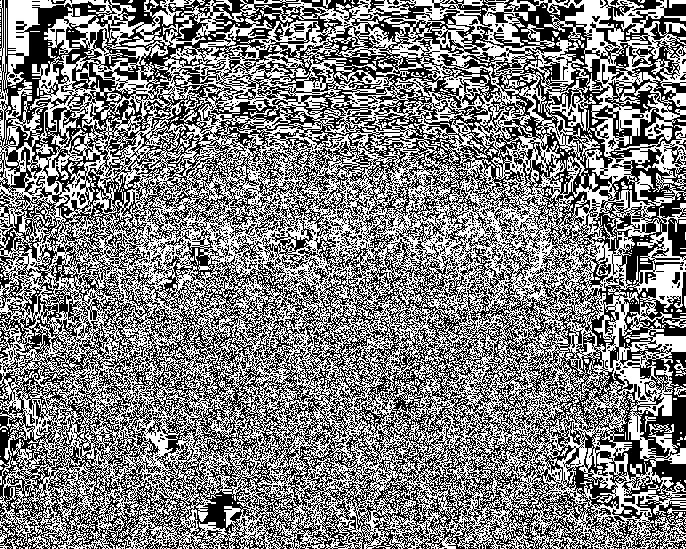

# Stego

- - -

## 1% Power
relevant files:
* 1_power.jpg

ezpz, just do `strings 1_power.jpg | grep flag`

- - -

## 15% Power
relevant files:
* 15_power.jpg
* extracted_at_0xd110.jpg

use cyberchef `extract files`, there is another jpg hidden in the jpg
the extracted file has the image

- - -

## 30% Power
relevant files:
* 30_power.jpeg
* 30_power-extracted.jpg

this one had me for a long time. the hint was "RRRRRAAAAAAAWWWWWWRRRR!!!!!", and I thought it had
something to do with the channels the data was hidden in. I slammed my head against stegsolve for multiple
hours before I really thought about it:

RRRRAAAAWWWWRRR  
RAWR  
RAR  
.rar  

just run unrar on the image: ``unrar 30_power.jpeg``

- - -

## 60% Power
relevant files:
* 60_power.png
* 60_power2.png

this one is pretty cool. I tried the standard stego things to no avail (strings, binwalk, jsteg, stegsolve, steganabra),
 so I decided to just look at the hexdump. 

    00000000  89 50 4e 47 0d 0a 1a 0a  00 00 00 0d 49 48 44 52  |.PNG........IHDR|
    00000010  00 00 01 88 00 00 01 ad  08 02 00 00 00 83 40 74  |..............@t|
    00000020  f4 00 00 00 09 70 48 59  73 00 00 0e f3 00 00 0e  |.....pHYs.......|
    00000030  f3 01 1c 53 99 3a 00 00  00 11 74 45 58 74 54 69  |...S.:....tEXtTi|
    00000040  74 6c 65 00 50 44 46 20  43 72 65 61 74 6f 72 41  |tle.PDF CreatorA|
    00000050  5e bc 28 00 00 00 13 74  45 58 74 41 75 74 68 6f  |^.(....tEXtAutho|
    00000060  72 00 50 44 46 20 54 6f  6f 6c 73 20 41 47 1b cf  |r.PDF Tools AG..|
    00000070  77 30 00 00 00 2d 7a 54  58 74 44 65 73 63 72 69  |w0...-zTXtDescri|
    00000080  70 74 69 6f 6e 00 00 08  99 cb 28 29 29 b0 d2 d7  |ption.....())...|
    00000090  2f 2f 2f d7 2b 48 49 d3  2d c9 cf cf 29 d6 4b ce  |///.+HI.-...).K.|
    000000a0  cf 05 00 6e 9f 08 f1 97  af 2c b8 00 02 06 10 4d  |...n.....,.....M|
    000000b0  45 4d 45 89 50 4e 47 0d  0a 1a 0a 00 00 00 0d 49  |EME.PNG........I|
    000000c0  48 44 52 00 00 02 4e 00  00 02 58 08 06 00 00 00  |HDR...N...X.....|
    000000d0  94 d6 69 73 00 00 00 01  73 52 47 42 00 ae ce 1c  |..is....sRGB....|
    000000e0  e9 00 00 00 04 67 41 4d  41 00 00 b1 8f 0b fc 61  |.....gAMA......a|
    000000f0  05 00 00 00 09 70 48 59  73 00 00 1d 86 00 00 1d  |.....pHYs.......|
    00000100  86 01 5d a2 13 81 00 00  ff a5 49 44 41 54 78 5e  |..].......IDATx^|
    00000110  ec 9d 07 60 64 57 75 fe  cf f4 aa 51 d7 4a db b4  |...`dWu....Q.J..|
    00000120  bd 78 9b 7b 5b 37 6c dc  6d c0 36 98 62 d3 8b 21  |.x.{[7l.m.6.b..!|
    00000130  24 21 04 fe 09 2d 21 24  40 02 a1 86 6a d3 02 98  |$!...-!$@...j...|

At first glance it looks all normal, so I looked into the PNG format for clues.  
every PNG has chunks of metadata in the beginning of the file, and all of them need an IHDR chunk which
determines things like the width and height of the image. You can identify IHDR chucks because they begin with the
characters ``IHDR``, which should be 8 bytes after the magic ``PNG``. I noticed that this file has 2 IHDR chunks, which
is not right. Then you can see that there is a string "MEME.PNG", which I thought was just filename metadata, but
the PNG in that string is in the right place to be magic bytes for the second IHDR chunk. I removed all of the data
before the second PNG and voila, there be a flag in the new image.

- - -

## Final Form
relevant files:
* final_form.png

the hint for this one gave it all away, "you are not the least bit significant against my power. you'll be seeing red by the end of this"
least bit significant, red. Red channel LSB. I used stegsolve to extract this data but at first it didn't work. I examined the red 0 channel
and noticed a weird pattern along the left side of the image,  

  

so I extracted the data by column instead of by row (stegsolve has an option for this) and the flag was at the beginning of the extracted data.

- - -
